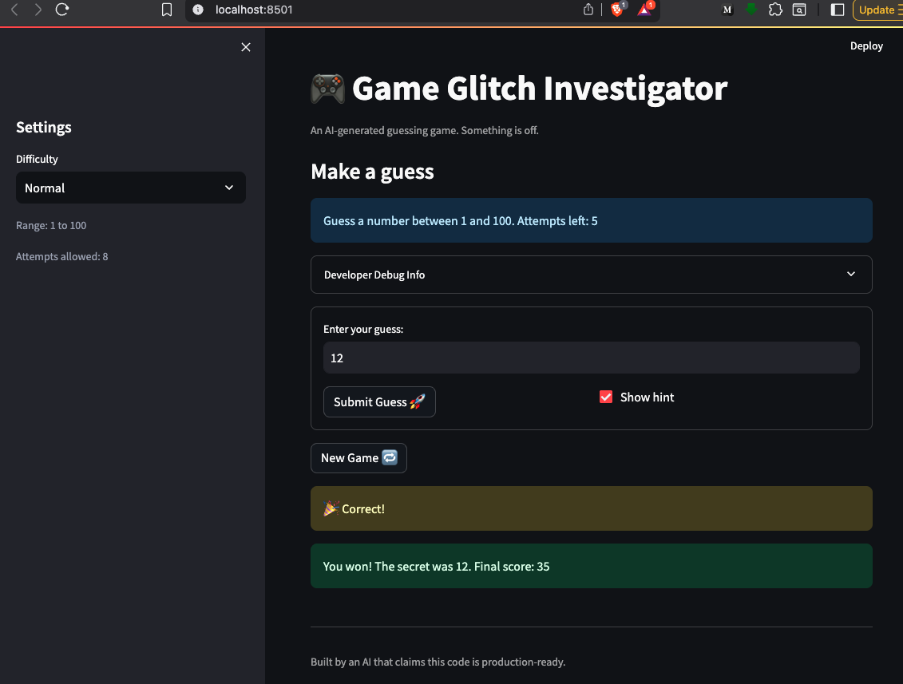
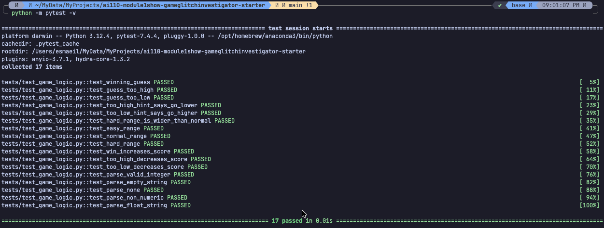

# 🎮 Game Glitch Investigator: The Impossible Guesser

## 🚨 The Situation

You asked an AI to build a simple "Number Guessing Game" using Streamlit.
It wrote the code, ran away, and now the game is unplayable. 

- You can't win.
- The hints lie to you.
- The secret number seems to have commitment issues.

## 🛠️ Setup

1. Install dependencies: `pip install -r requirements.txt`
2. Run the broken app: `python -m streamlit run app.py`

## 🕵️‍♂️ Your Mission

1. **Play the game.** Open the "Developer Debug Info" tab in the app to see the secret number. Try to win.
2. **Find the State Bug.** Why does the secret number change every time you click "Submit"? Ask ChatGPT: *"How do I keep a variable from resetting in Streamlit when I click a button?"*
3. **Fix the Logic.** The hints ("Higher/Lower") are wrong. Fix them.
4. **Refactor & Test.** - Move the logic into `logic_utils.py`.
   - Run `pytest` in your terminal.
   - Keep fixing until all tests pass!

## 📝 Document Your Experience

This project is a Streamlit number guessing game where the player tries to find the secret number within a limited number of attempts. The goal of the lab was to investigate broken AI-generated code, debug the problems, and make the game playable again.

The main bugs I found were that pressing Enter did not submit a guess, the higher/lower hints were reversed, the developer debug info showed stale values, and starting a new game did not fully reset the game state. I also found logic issues in the difficulty ranges, score handling, attempt initialization, and secret-number generation for a new game.

I fixed those problems by wrapping the input in a `st.form`, correcting the hint logic, keeping the debug panel at the top with an `st.empty()` placeholder, and resetting all relevant session-state values on a new game. I also moved the shared game logic into `logic_utils.py` and added pytest coverage so the repaired behavior is checked automatically.

## 📸 Demo

## ✅ Test Results

The repaired logic is covered by pytest tests for guess checking, score updates, input parsing, and difficulty ranges.

## 🚀 Stretch Features

- [ ] [If you choose to complete Challenge 4, insert a screenshot of your Enhanced Game UI here]
